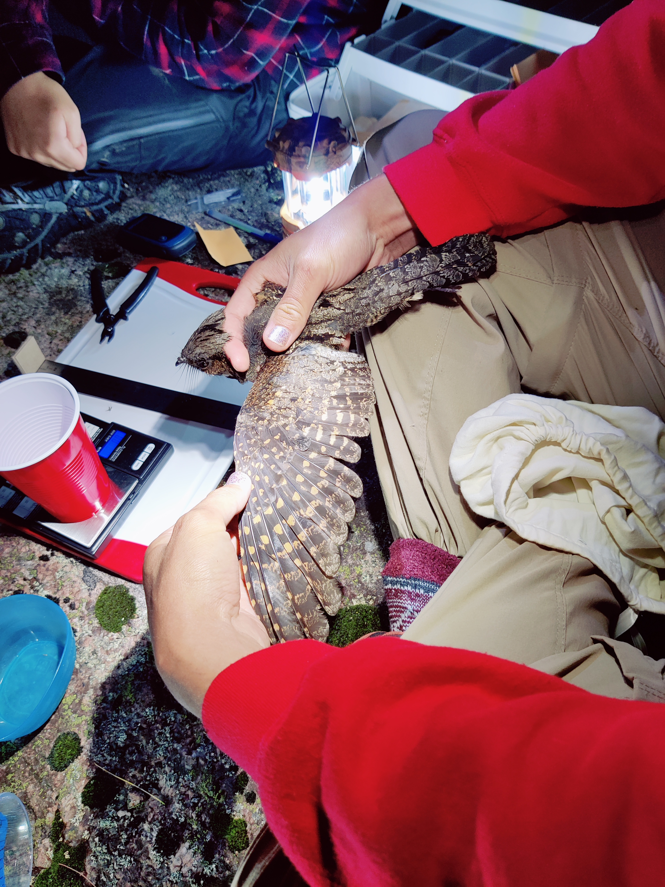
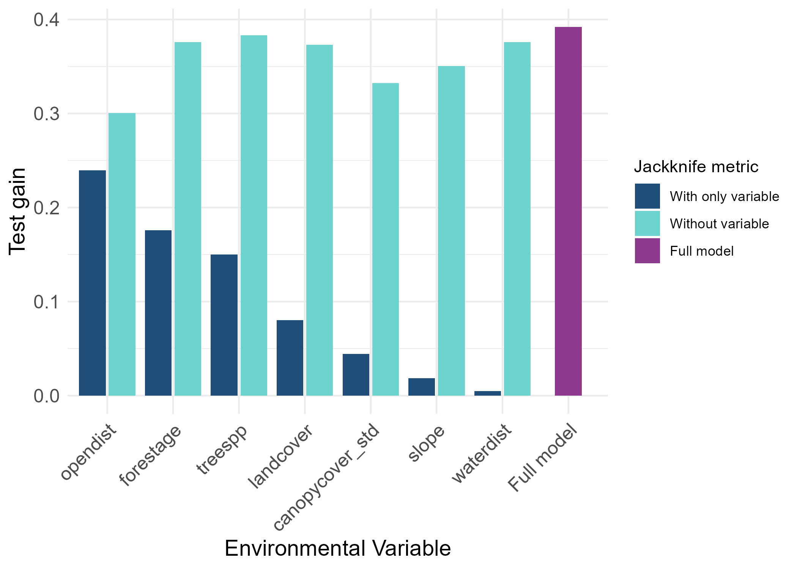
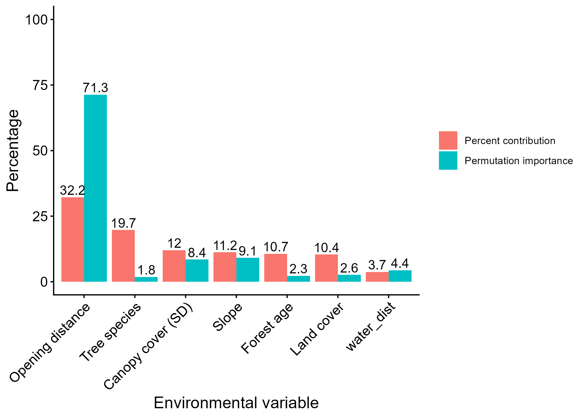
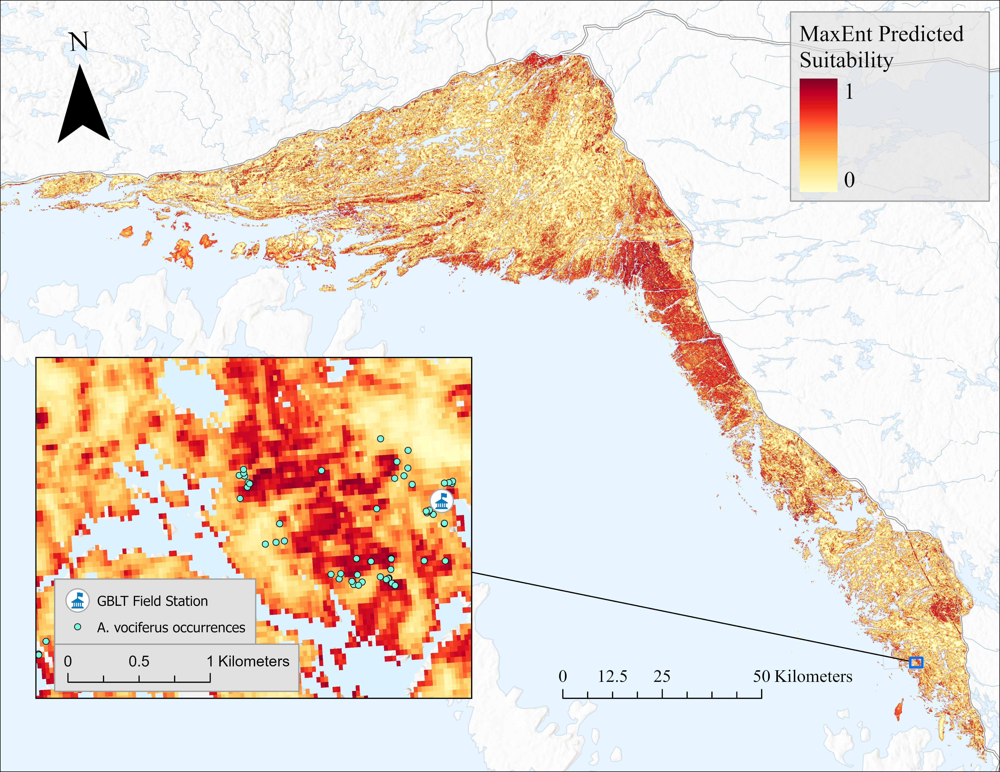
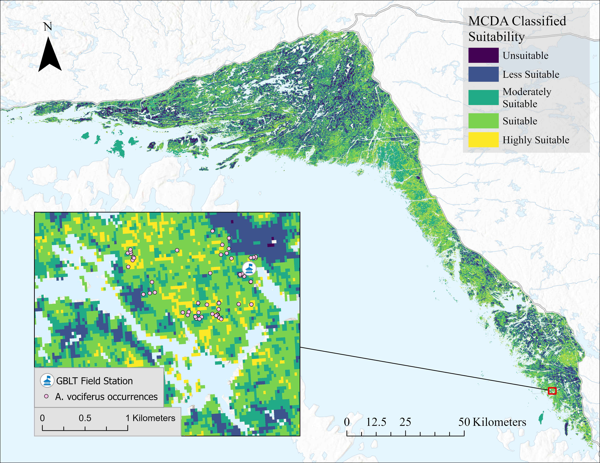
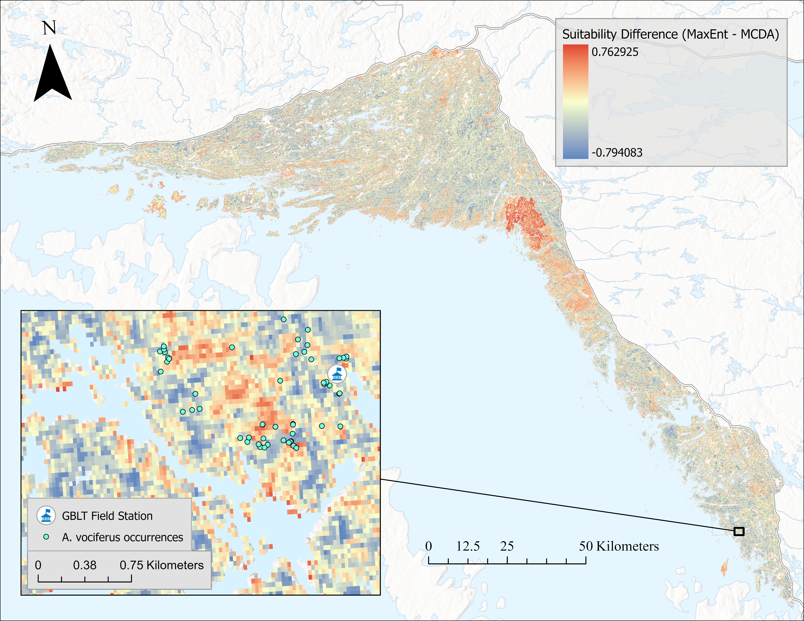
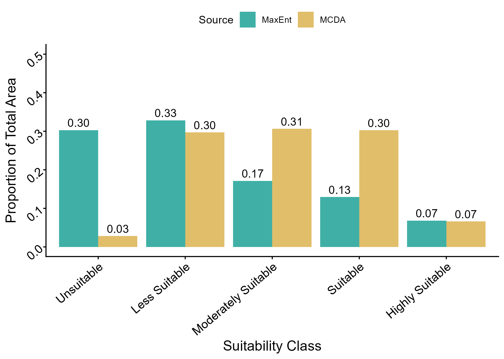

# Background
Species depend on specific environmental conditions to survive, making them vulnerable to habitat loss, degradation, and fragmentation driven by land use change. Habitat suitability models (HSMs) help address this challenge by linking species occurrences with environmental variables to map areas of potential habitat and guide conservation planning. This study focuses on Antrostomus vociferus (Eastern Whip-poor-will), a cryptic and nocturnal bird listed as threatened in Canada that has experienced a 35.2% population decline over the past 30 years. Traditional survey methods often fail to detect this species due to its nocturnal behavior and tendency to occur away from roads, making modeling approaches particularly valuable for understanding its habitat distribution. To estimate suitable habitat, this study compares two HSM approaches using the same occurrence and environmental datasets: a knowledge-driven Multi-Criteria Decision Analysis (MCDA) model and a data-driven Maximum Entropy (MaxEnt) model. MCDA integrates environmental variables based on expert-derived weightings, while MaxEnt uses machine learning to identify environmental conditions associated with known occurrences. By comparing these approaches, the study evaluates how expert knowledge and statistical inference differ in identifying suitable habitat and representing the ecological niche of A. vociferus.




## Data and Methods
### Data
The study was conducted on protected lands managed by the Georgian Bay Land Trust (GBLT) along the eastern shore of Georgian Bay, Ontario, within the Georgian Bay Ecoregion of the Great Lakes–St. Lawrence Forest Region. This landscape contains a diverse mosaic of mixed, deciduous, and coniferous forests shaped by varied geology, soils, and terrain, creating structurally complex habitats important for Antrostomus vociferus (Eastern Whip-poor-will). Occurrence records from 2000–2025 were compiled from Georgian Bay Land Trust surveys, the Ontario Natural Heritage Information Centre (NHIC), and the Global Biodiversity Information Facility (GBIF). Environmental predictors included topography, land cover, distance to water and openings, canopy structure metrics, forest age, and dominant tree species derived from national forest monitoring datasets. All spatial layers were standardized to a common coordinate system, masked to the study area, and screened for multicollinearity before modelling.

### Methods
Habitat suitability for A. vociferus was estimated using two approaches: a machine-learning Maximum Entropy (MaxEnt) model and a knowledge-driven Multi-Criteria Decision Analysis (MCDA) framework. MaxEnt used occurrence records and environmental predictors to estimate the probability of suitable habitat across the study area, with model performance optimized through bias correction, regularization multiplier tuning, and five-fold cross validation. The MCDA model classified each environmental variable into suitability classes based on ecological literature and expert judgement, then combined them using weighted overlay derived from an Analytical Hierarchy Process. Model outputs were converted into five habitat suitability classes and compared by evaluating predicted area in each class and by generating a difference map to identify spatial agreement and disagreement between the two modelling approaches.

### Results
The MaxEnt model produced a moderate predictive performance (test AUC ≈ 0.73), with distance to opening emerging as the strongest predictor of Antrostomus vociferus habitat suitability, followed by canopy cover variability, slope, forest age, and tree species. Suitability decreased sharply as distance from forest openings increased, while areas with greater canopy heterogeneity and both young and older forest stands showed higher predicted suitability. The resulting MaxEnt suitability map identified several habitat hotspots across the Georgian Bay Land Trust study area, including regions not represented in the occurrence dataset. 







The MCDA model produced a comparable suitability surface using expert-derived weights, with canopy cover variability, distance to openings, and forest age ranked as the most influential variables and an overall point-prevalence validation accuracy of 0.63. 



Comparison of the two models showed broadly similar spatial patterns, though MaxEnt predicted more unsuitable habitat overall and highlighted several additional suitability hotspots, while MCDA predicted slightly more diffuse areas of moderate suitability across the landscape.





### Code snippets
#### Combining all datasets into one CSV - Maxent ready
```{r}
gblt_occ <- read.csv("C:/Users/pgrieve.stu/OneDrive - UBC/Desktop/FCOR 599/10.maxent/data/occurrences/gblt_occ.csv")
gbif_occ <- read.csv("C:/Users/pgrieve.stu/OneDrive - UBC/Desktop/FCOR 599/10.maxent/data/occurrences/gbif_occ.csv")
nhic_occ <- read.csv("C:/Users/pgrieve.stu/OneDrive - UBC/Desktop/FCOR 599/10.maxent/data/occurrences/nhic_occ.csv")

#combine using row bind - all have the same columns
combined_occ <- bind_rows(gblt_occ, gbif_occ, nhic_occ) %>% 
  #remove any rows that have the same latitude and longitude
  distinct(latitude, longitude, .keep_all = TRUE) %>% 
  filter(year >= 2000) %>% 
  select(species, longitude, latitude)

combined_occ <- combined_occ %>% # keep only needed columns
  mutate(
    species = case_when(
      str_detect(species, regex("Eastern Whip[- ]?poor[- ]?will", ignore_case = TRUE)) ~ "Eastern Whip Poor Will",
      str_detect(species, regex("Antrostomus vociferus", ignore_case = TRUE)) ~ "Eastern Whip Poor Will",
      TRUE ~ species  # leave others unchanged
    )
  )
# check
head(combined_occ)

#Write file
write.csv(
  combined_occ,
  file = "C:/Users/pgrieve.stu/OneDrive - UBC/Desktop/FCOR 599/10.maxent/data/occurrences/combined_occ.csv",
  row.names = FALSE
)
```

#### Landcover preprocessing
```{r}
#locate file
landcover_raw <- rast("C:/Users/pgrieve.stu/OneDrive - UBC/Desktop/FCOR 599/10.maxent/data/raw_env_layers/landcover_raw/LCR_RCT_2020.tif")

#check crs
crs(landcover_raw)

#reproject study site into same crs, buffer, and crop landcover
study_vect_3347_buff <- st_read("C:/Users/pgrieve.stu/OneDrive - UBC/Desktop/FCOR 599/10.maxent/data/raw_env_layers/study_area/GBLT_Study_Area_Boundary.shp") %>% 
  st_transform(crs(landcover_raw)) %>%  
  st_buffer(dist = 25000) %>% 
  vect()

#crop and reproject
landcover_wgs_crop <- crop(landcover_raw, study_vect_3347_buff) %>% 
  project("EPSG: 4326", method = "near")

#force to match DEM (buffered)
landcover_wgs <- resample(
  landcover_wgs_crop,
  dem_wgs_buff,
  method = "near"
)

#mask - 
landcover <- mask(landcover_wgs, study_area_wgs)


#sanity check to ensure geometry is the same
compareGeom(landcover, dem, stopOnError = FALSE)

#make sure is factor to apply labelling
landcover <- as.factor(landcover)

#Create the class table
lc_classes <- data.frame(
  ID = 1:10,
  class = c(
    "Built-up / artificial",
    "Cropland",
    "Inland water",
    "Treed (non-wetland)",
    "Treed wetland",
    "Treed area disturbance",
    "Grassland / shrubland",
    "Wetland (non-treed)",
    "Sparsely vegetated",
    "Barren land"
  )
)

#attach to spatraster
levels(landcover) <- lc_classes


#apply mask for subsequent environmental files
water_mask <- ifel(landcover == 3, NA, 1)


env_mask <- ifel(landcover == 3 | landcover == 1, NA, 1)

landcover_water <- mask(landcover, water_mask)
landcover_artificial <- mask(landcover, env_mask)

landcover <- landcover_artificial

#handle NAN
landcover[is.nan(landcover)] <- NA


#force terra to read the file and remove NAN
values(landcover) <- values(landcover)

#sanity check
any(is.nan(values(landcover)))
any(is.infinite(values(landcover)), na.rm = TRUE)


#write to file tif and asc
#write to file
writeRaster(landcover, "data/maxent_jar_files/env_layers/landcover.asc", 
            overwrite = TRUE,
            NAflag = -9999)
writeRaster(landcover, "data/env_layers/landcover.tif", overwrite = TRUE)
```

#### Weighted Linear Combination
```{r}
#create classified raster stack

classified_env_list <- c(cstd = canopycover_std_reclass,
                         od = opendist_reclass,
                         fa = forestage_reclass,
                         ts = tree_reclass,
                         lc = landcover_reclass,
                         sl = slope_reclass,
                         wd = waterdist_reclass
                        )

#ensure it is spatraster
classified_env_stack <- rast(classified_env_list)

#assign weights in order
w <- c(
  cstd = 0.35985850 ,
  od   = 0.24526583 ,
  fa   = 0.15360293 ,
  ts   = 0.09925436 ,
  lc   = 0.06352719 ,
  sl   = 0.04321975 ,
  wd   = 0.03527143
)

# force to match the raster stack order
w <- w[names(classified_env_stack)]


# WLC with lapp()
wlc <- lapp(classified_env_stack, fun = function(cstd, od, fa, ts, lc, sl, wd) {
  cstd*w["cstd"] +
  od*w["od"] +
  fa*w["fa"] +
  ts*w["ts"] +
  lc*w["lc"] +
  sl*w["sl"] +
  wd*w["wd"]
})

#find min/max
range(wlc)

#normalize to 0-1 (From range function)
wlc_norm <- (wlc - 1.177290)/ (5 - 1.177290)

wlc_norm <- terra::clamp(wlc_norm, lower = 0, upper = 1, values = TRUE)

#check
range(wlc_norm)

#classify into 5 suitability classes
wlc_classes <- matrix(c(
  0, 0.2, 1,
  0.2, 0.4, 2,
  0.4, 0.6, 3,
  0.6, 0.8, 4,
  0.8, 1.1, 5
), ncol = 3, byrow = TRUE)

wlc_classified <- classify(wlc_norm, wlc_classes, include.lowest = TRUE)

#check if reclass did its job - should be x1= 1, x2 = 5
global(wlc_classified, range, na.rm = TRUE)
unique(wlc_classified)

#check summary stats of MCDA values in mask
summary(wlc_classified)

#plot
plot(wlc_norm, main = "Continuous MCDA Suitability")
plot(wlc_classified, main = "5 Class MCDA Suitability")

#write to file
writeRaster(wlc_norm, filename = "outputs/mcda_continuous.tif", overwrite = TRUE)
writeRaster(wlc_classified, filename = "outputs/mcda_classified5.tif", overwrite = TRUE)

```
